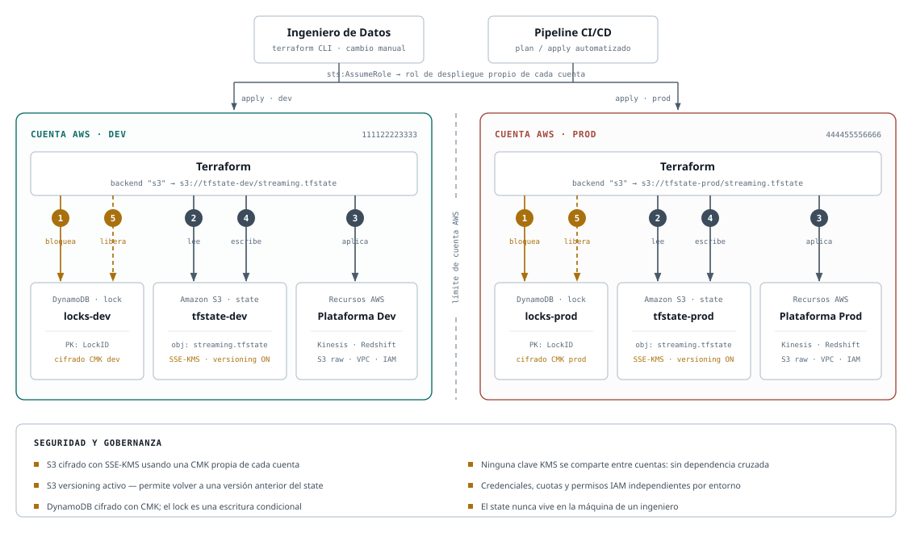
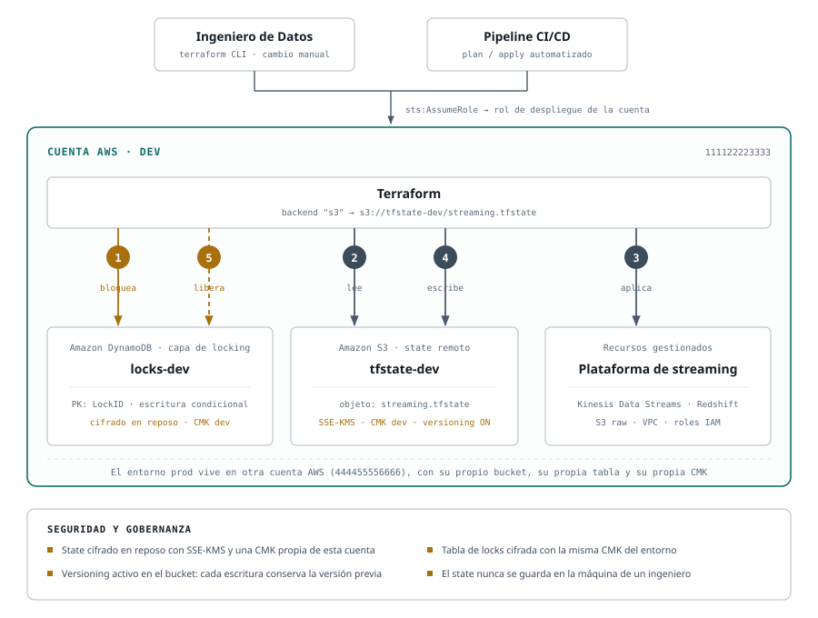
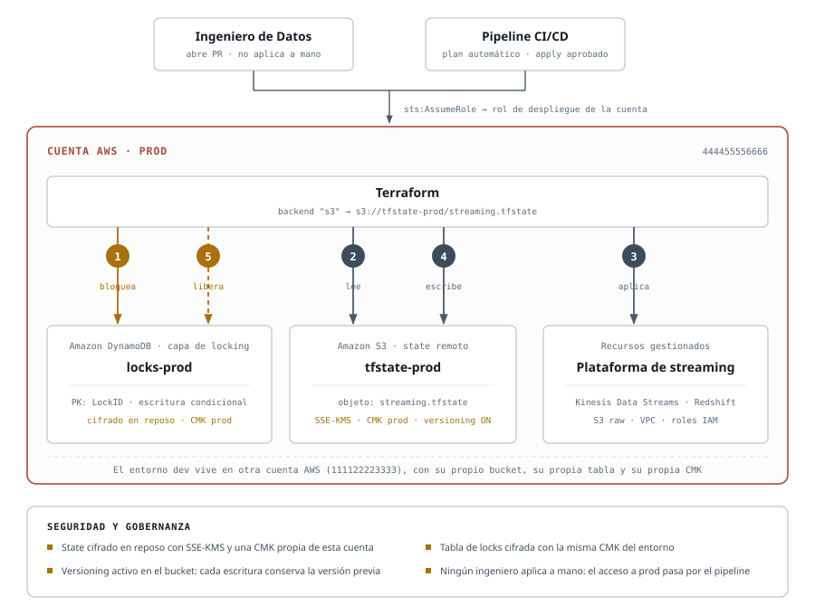

# Entrega 2 — Backend remoto y gobernanza del estado de Terraform

Diseño de una arquitectura de backend que permite a un equipo de Data Engineers trabajar en
simultáneo sobre una plataforma de ingesta en tiempo real (**Kinesis + Redshift**) sin riesgo de
corromper el estado de Terraform.

**Estrategia de aislamiento:** una cuenta de AWS por entorno · **Estado:** S3 versionado y cifrado
con KMS · **Concurrencia:** locking en DynamoDB

---

## Contenido

| Archivo | Qué es |
|---|---|
| [`diagrama-01-arquitectura-multicuenta.svg`](diagrama-01-arquitectura-multicuenta.svg) | Vista general: los dos entornos y el límite de cuenta entre ellos |
| [`diagrama-02-flujo-dev.svg`](diagrama-02-flujo-dev.svg) | Detalle del ciclo completo en la cuenta de desarrollo |
| [`diagrama-03-flujo-prod.svg`](diagrama-03-flujo-prod.svg) | Detalle del ciclo completo en la cuenta de producción |
| [`backend-terraform.html`](backend-terraform.html) | Versión navegable de este documento, con el diagrama embebido |

---

## 1. Arquitectura general

La vista combinada es la que evidencia la **estrategia de separación**: se ven los dos entornos y,
entre ellos, el límite de cuenta que impide cualquier ruta de uno al otro.

### Componentes

| Componente | Rol en la arquitectura |
|---|---|
| **Ingeniero de Datos** | Iniciador de cambios. Ejecuta Terraform desde su equipo contra el entorno de desarrollo. |
| **Pipeline CI/CD** | Iniciador automatizado. Corre `plan` y `apply`; en producción, el `apply` requiere aprobación. |
| **Terraform** | Componente lógico que orquesta el ciclo. No guarda nada localmente: todo su estado vive en S3. |
| **Amazon S3** | Destino del state remoto. Un bucket por cuenta, versionado y cifrado con SSE-KMS. |
| **Amazon DynamoDB** | Capa de locking. Una tabla por cuenta, con `LockID` como clave de partición. |
| **Recursos AWS** | La infraestructura gestionada: Kinesis Data Streams, Redshift, S3 raw, VPC y roles IAM. |

---

## 2. Segmentación por entornos

La separación es **por cuenta de AWS**, el borde de aislamiento más fuerte que ofrece la plataforma.

| | Desarrollo | Producción |
|---|---|---|
| Cuenta AWS | `111122223333` | `444455556666` |
| Bucket de state | `s3://tfstate-dev/streaming.tfstate` | `s3://tfstate-prod/streaming.tfstate` |
| Tabla de locking | `locks-dev` | `locks-prod` |
| Clave de cifrado | CMK propia de la cuenta dev | CMK propia de la cuenta prod |
| Acceso | Ingeniero + pipeline | Solo pipeline, con aprobación manual |

**Nada se comparte entre columnas.** No es el mismo bucket con prefijos distintos ni la misma tabla
con claves distintas: son objetos en cuentas separadas, con credenciales, cuotas, políticas IAM y
facturación independientes.

El pipeline de CI/CD alcanza cada entorno mediante `sts:AssumeRole`, asumiendo un rol de despliegue
definido dentro de esa cuenta. Así, el permiso para desplegar en producción es un privilegio
explícito y auditable, no un efecto secundario de tener acceso al repositorio.

---

## 3. Flujo de operación

Los cinco pasos ocurren siempre en este orden, **dentro de una sola cuenta**. Una corrida en dev y
una en prod son dos ciclos completamente independientes que nunca tocan los mismos objetos.

| # | Paso | Servicio | Qué ocurre |
|---|---|---|---|
| **1** | Intento de bloqueo | DynamoDB | Escribe un ítem `LockID` **con la condición de que no exista**. Si otra corrida ya lo tomó, la condición falla y Terraform se detiene. |
| **2** | Lectura del estado | S3 | Descarga el `.tfstate` y lo descifra con la CMK de la cuenta. Ese archivo es el inventario de lo que ya existe. |
| **3** | Aplicación de cambios | Recursos AWS | Compara el estado contra el código, calcula la diferencia y llama a las APIs para crear, modificar o eliminar recursos. |
| **4** | Actualización del estado | S3 | Sube el estado nuevo. El versioning conserva la versión anterior. |
| **5** | Liberación del bloqueo | DynamoDB | Borra el ítem `LockID`. Recién ahí otra corrida puede empezar. |

> **Por qué el orden importa:** el bloqueo se toma **antes** de leer y se libera **después** de
> escribir. Ese envoltorio convierte "leer, calcular y escribir" en una operación indivisible: nadie
> puede leer el estado en el medio y trabajar sobre una foto que ya quedó vieja.

### Detalle por entorno

**Desarrollo**

**Producción**

---

## 4. Seguridad y gobernanza

- **Cifrado del state (SSE-KMS).** El bucket cifra el objeto en reposo con una **CMK propia de cada
  cuenta**. Que no sea compartida es deliberado: una clave común volvería a crear la dependencia
  entre entornos que el diseño busca eliminar.
- **Versionado de S3.** Cada escritura conserva la versión anterior. Un state corrupto o una corrida
  interrumpida se recuperan restaurando la revisión previa, sin reconstruir el inventario a mano.
- **Cifrado de la tabla de locks.** DynamoDB cifra en reposo con la misma CMK del entorno.
- **Sin state local.** El `.tfstate` nunca se guarda en la máquina de un ingeniero.
- **Acceso a producción por pipeline.** El `apply` en prod pasa por aprobación; nadie aplica a mano.

### Por qué el state es un archivo sensible

El `.tfstate` guarda **en texto plano** los atributos de todo lo que Terraform administra. Si
Terraform crea una base de datos con contraseña, esa contraseña queda escrita en el archivo. Por eso
el cifrado no es una mejora opcional: es un requisito.

---

## 5. Justificación

Esta arquitectura reduce el riesgo de corrupción del state porque combina dos mecanismos que
resuelven problemas distintos. El primero es el **backend remoto**: el estado deja de vivir en el
disco de un ingeniero y pasa a un bucket de S3 al que todo el equipo apunta, de modo que no existen
copias divergentes del inventario de infraestructura. El segundo es el **locking en DynamoDB**: antes
de leer, Terraform escribe un ítem de bloqueo mediante una escritura condicional, una operación que la
base garantiza atómica. Si dos ejecuciones arrancan a la vez, solo una consigue escribir ese ítem; la
segunda recibe el error y se detiene sin haber tocado nada. Sin ese lock, ambas leerían la misma
versión del estado, cada una calcularía su plan sobre una foto desactualizada y la última en escribir
borraría el registro de los recursos que creó la otra: recursos reales existiendo en AWS sin que
Terraform sepa que existen.

La estrategia **multi-cuenta** reduce el *blast radius*, es decir, el alcance del daño cuando algo
sale mal. El estado de dev y el de prod no comparten el bucket, la tabla de bloqueo, la clave KMS ni
las credenciales: son objetos en cuentas de AWS distintas. Un `destroy` ejecutado por error, un
backend mal configurado o una credencial filtrada en dev no pueden alcanzar el estado de prod, porque
desde la cuenta de dev sencillamente no hay ruta hacia esos recursos. El aislamiento no depende de que
nadie se equivoque al escribir un prefijo: lo impone el límite de cuenta, que es el borde de seguridad
más fuerte que ofrece AWS. El pipeline accede a cada entorno asumiendo un rol específico mediante
`sts:AssumeRole`, de manera que los permisos para desplegar en producción son un privilegio explícito
y auditable.

Por último, las medidas de gobernanza aportan resiliencia y confidencialidad. El **versionado de S3**
guarda cada revisión del archivo de estado, así que una corrida interrumpida a mitad de la escritura o
un estado corrupto se recuperan restaurando la versión inmediatamente anterior. El **cifrado con KMS**
protege un archivo que es sensible por naturaleza, ya que el state conserva en texto plano los
atributos de todo lo gestionado. Frente a un estado local —donde no hay bloqueo, ni historial, ni
cifrado, ni copia recuperable— esta arquitectura convierte el archivo más frágil del proyecto en el
mejor protegido.

---

## 6. Estrategia de separación: tres niveles

"Separar dev de prod" no es una decisión binaria, es una escala. Cada nivel elimina una superficie de
error más, a cambio de más trabajo de montaje.

| Nivel | Qué separa | Qué sigue compartido | Riesgo que queda |
|---|---|---|---|
| Prefijo (`key`) | Un archivo de estado por entorno dentro del mismo bucket | Bucket, tabla de locks, clave KMS, cuenta y credenciales | Un error de tipeo en la `key` apunta a prod. Quien puede leer un estado, puede leerlos todos. |
| Bucket + tabla | Recursos físicos distintos por entorno | Cuenta AWS, credenciales, límites de servicio | Una credencial comprometida sigue alcanzando ambos entornos. |
| **Cuenta AWS** ← este diseño | Todo: bucket, tabla, claves, IAM, cuotas y facturación | Nada | Requiere AWS Organizations y roles cruzados para el pipeline. |

> **El error más grave no está en la tabla.** Mezclar dev y prod en el **mismo archivo de estado** no
> es un nivel de aislamiento: es la ausencia de cualquiera. Con un solo state, un `terraform destroy`
> pensado para dev destruye producción, porque para Terraform ambos entornos son el mismo inventario.

---

## 7. Verificación contra los criterios

**Criterios de aceptación**

- [x] Notación estándar con formas y etiquetas definidas de forma consistente.
- [x] Relación explícita entre Terraform, S3 (state) y DynamoDB (locking) dentro de un mismo flujo.
- [x] Estrategia de separación de estados visible: arquitectura multi-cuenta con el límite dibujado.
- [x] Explicación de tres párrafos que justifica la reducción de riesgo frente al estado local.

**Errores comunes evitados**

- [x] **Estados de dev y prod en el mismo archivo físico.** Son dos objetos distintos, en dos buckets
      distintos, en dos cuentas distintas. Los diagramas muestran la ruta completa
      (`s3://tfstate-dev/...` y `s3://tfstate-prod/...`) para que no se lea como separación por prefijo.
- [x] **DynamoDB ausente del flujo de locking.** Está como pasos ① y ⑤ dentro del ciclo numerado,
      resaltado en ámbar, no como una caja decorativa al costado.
- [x] **Cifrado no indicado.** SSE-KMS aparece en la caja de S3, en la de DynamoDB y en el panel de
      gobernanza de los tres diagramas.

---

## 8. Glosario

<b>El state (<code>.tfstate</code>)</b>

Un archivo JSON donde Terraform anota todo lo que creó y con qué identificador real de AWS. Es su
memoria: sin él, Terraform no sabe que tu VPC existe y en la corrida siguiente intenta crearla de
nuevo. Es el único componente del sistema que no se puede reconstruir mirando el código, y por eso
todo este diseño existe para protegerlo.

<b>Backend remoto</b>

La configuración que le dice a Terraform dónde guardar el state. Por defecto es el disco local; un
backend remoto lo manda a S3. Es lo que permite que dos personas trabajen sobre el mismo inventario
en vez de sobre dos copias que divergen en silencio.

<b>Lock y condición de carrera</b>

Una condición de carrera ocurre cuando dos procesos leen el mismo dato, lo modifican por separado y
escriben encima del otro. El resultado no es la suma de los dos cambios: es el del que llegó último, y
el trabajo del primero desaparece.

Un lock lo evita obligando a pedir turno. DynamoDB sirve para esto porque permite decir "escribí este
ítem **solo si** no existe" y garantiza que, entre miles de intentos simultáneos, exactamente uno gana.

<b>Amazon S3 y el versionado</b>

S3 es el almacenamiento de archivos de AWS; los archivos viven en *buckets*, cuyo nombre es único a
nivel mundial. Con versioning activado, cada vez que se sobrescribe un archivo el anterior no se
borra: queda en el historial y se puede restaurar.

<b>KMS y CMK</b>

KMS es el servicio de claves de cifrado de AWS. Una CMK es una clave que administrás vos, con su
propia política de acceso. **SSE-KMS** significa que S3 cifra el objeto al guardarlo usando esa clave,
y solo lo descifra para quien tenga permiso de usarla.

<b>Cuenta AWS y blast radius</b>

Una cuenta de AWS es un contenedor completamente separado: recursos, usuarios, permisos, límites y
factura propios. Cruzar de una a otra exige un permiso explícito (`sts:AssumeRole`).

*Blast radius* es el radio de explosión: hasta dónde llega el daño de un error. Separar por cuenta lo
reduce al mínimo, porque desde dev no hay ninguna ruta hacia los recursos de prod.

---

## Nota sobre la evolución del locking

Desde **Terraform 1.10**, S3 soporta locking nativo mediante `use_lockfile = true`, y el parámetro
`dynamodb_table` del bloque `backend` quedó deprecado. Esta entrega usa DynamoDB porque la consigna lo
pide explícitamente y porque sigue siendo el mecanismo más difundido, pero en un diseño nuevo hoy
convendría evaluar el bloqueo nativo, que elimina la necesidad de la tabla.

La misma observación está registrada en las notas de la [entrega 1](../entrega_1/README.md).
